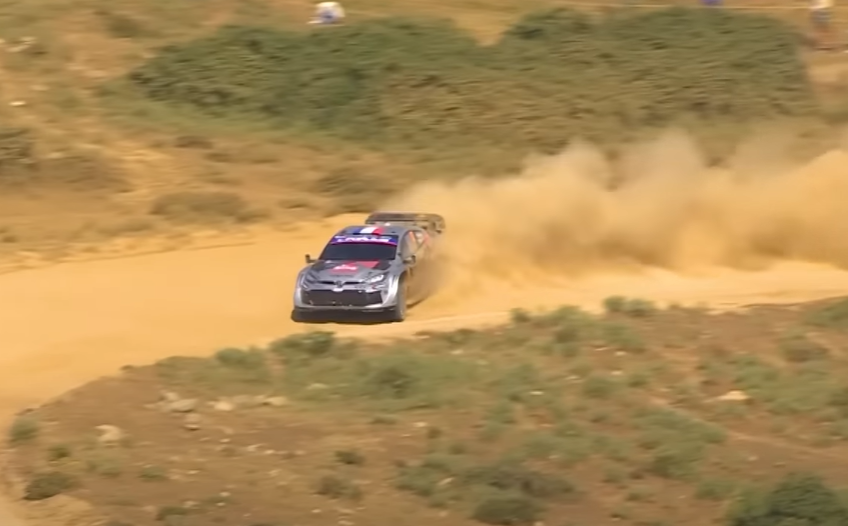
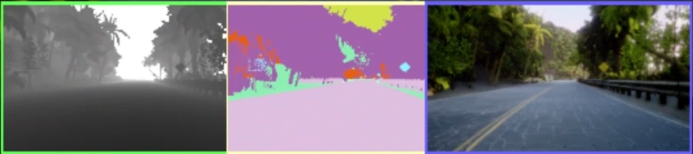

# CNN 기반 자율주행 프로젝트

환경 : Microsoft Airsim

언어 : Python 3.10

사용한 강화학습 라이브러리: stable_baseline3 A2C, gymnasium

참고 자료: https://microsoft.github.io/AirSim/reinforcement_learning/,
Google Gemini 2.5



평소 WRC나 F1 같은 자동차 경주를 좋아해 이번 기회에 CNN과 강화학습을 기반으로
도로를 멋지게 달리는 자율 주행 프로젝트를 진행하였습니다.

실제 환경에서 학습을 진행하기엔 여건이 되지 않아 Microsoft의 Airsim이라는
자율주행 연구용 시뮬레이터를 사용하였습니다.


Airsim에서 제공하는 Depth + Segmentation + RGB 카메라 3가지를 하나의 관측값으로 만들고,
추가로 path.csv 파일 처럼 웨이 포인트와 현재 자동차의 위치를 비교하며 reward를 줘 도로를 잘 달릴 수 있게 하였습니다.
Step 50000회 결과:

https://github.com/user-attachments/assets/efc773a8-3ed7-449b-a277-24cde7493ce7


```python
vision_obs = np.stack([img_gray, img_depth_gray, img_seg_gray], axis=-1)
```

Agent가 선택할 수 있는 Action
```python
self.car_controls.throttle = 0.4
        self.car_controls.brake = 0
        if action == 0: self.car_controls.steering = 0
        elif action == 1: self.car_controls.steering = -0.25
        elif action == 2: self.car_controls.steering = 0.25
        elif action == 3: self.car_controls.steering = -0.7
        elif action == 4: self.car_controls.steering = 0.7
        self.client.setCarControls(self.car_controls)
```

초반엔 Agent가 steer, accel, brake를 모두 continuous 하게 조작할 수 있게 했었는데 
그렇게 할 경우 Agent가 제대로 action을 선택하지 못해 학습이 느려지는 문제가 있었습니다.
따라서 Action Space를 Discrete하게 변경해서 더 빠르게 학습될 수 있도록 했습니다.

Reward 설계
```python
if self.last_collision_info.has_collided:
            return -20.0

        # 경로 유지에 대한 보상 강화
        deviation_reward = math.exp(-0.5 * abs(info['deviation'])) # 더 뾰족하게 만들어 중앙 유지 유도
        heading_reward = math.exp(-1.0 * abs(info['heading_error']))

        # 기본 보상은 경로 유지 점수
        reward = (deviation_reward + heading_reward) / 2
```

기본적으로 벽이나 장애물에 충돌하면 큰 패널티를 부여했고, 자동차의 상태에서 얻어낸 정보로
현재 도로와 얼마나 떨어져있는지(deviation_reward), 그리고 올바른 목표로 향하고 있는지(heading_error)를 미리 입력된
waypoint와 비교해서 reawrd를 계산했습니다.
